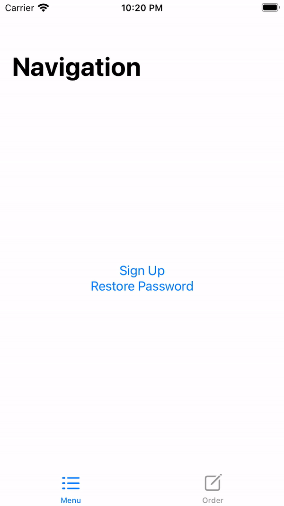

# SwiftUI-Route-Manager

It's a proposal on how to pop to root using SwiftUI native tools. 
This solution works well when the root view is a start point for two or more flows and at some point of these flows the user has the ability to do the pop to root.

More information you cane find [here](https://stackoverflow.com/questions/57334455/swiftui-how-to-pop-to-root-view/61926030)

## !! IMPORTANT !!

You should use the `unselect` method of the `RouteManager` when the user goes forward to the flow and then goes back by tapping on the back button. 
In this case, need to reset the state of our route manager for the previously selected flows to avoid undefined (unexpected) behavior:

    .onAppear {
        routeManager.unselect(.signUp)
        routeManager.unselect(.restorePassword)
    }

## Demo

